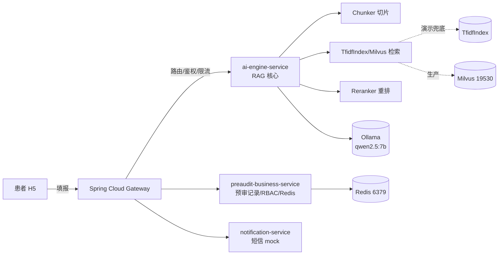

# 🏥 某地政务慢特病 AI 预审 · RAG 检索评估工程

> 把「能跑通的 Dify 应用」升级为「能讲深的 AI 工程作品」——含 RAG 评估脚本、切片 / 重排对比实验、微服务架构与可交互 Demo。


---

> **AI 应用落地工程师面试作品集** —— 把"会用 Dify"升级为"懂 AI 工程"。
> 覆盖：RAG 检索增强 · 切片策略实验 · 重排序（rerank）· 评估量化 · 本地大模型部署。
> 数据均为**模拟**，不含任何真实患者信息。

## 一句话亮点

不仅"能跑"，更"能讲深"：本仓库提供**可量化的 RAG 评估脚本**，用真实数字回答"切片切多大、要不要 rerank、模型怎么选"，而不是凭感觉。

## 特性

- 🔍 **零依赖 RAG 引擎**（`rag_core/`）：切片 → 检索 → 重排 → 生成，纯标准库实现，开箱即跑
- 📊 **RAG 评估**（`run_eval.py`）：输出 Recall@k / MRR / HitRate 真实对比
- 🧪 **切片粒度实验**：200 字 vs 500 字，有数据结论
- 🔁 **重排序模块**（`Reranker`）：已抽象接口，生产环境一行替换 cross-encoder
- 💬 **交互 Demo**（`app.py`，Gradio）：面试当场可玩
- 🐳 **容器编排**（`docker-compose.yml`）：Redis + Ollama 一键起

## 架构图



> 本仓库 `rag_core/` 即 `ai-engine-service` 的 RAG 核心；本地演示用 `TfidfIndex` 兜底，生产环境将检索替换为 Milvus，接口一致。

## 目录结构

```
jiangling-ai-preaudit/
├── README.md
├── requirements.txt
├── docker-compose.yml          # Redis + Ollama 一键起
├── Dockerfile
├── run_eval.py                 # 一键跑评估 + 切片/重排对比
├── app.py                      # Gradio 交互 demo
├── rag_core/
│   ├── chunker.py              # 切片（支持不同粒度 + overlap）
│   ├── retriever.py            # TF-IDF 检索（可替换 Milvus）
│   ├── reranker.py             # 重排序（预留 cross-encoder）
│   ├── generator.py            # Ollama 生成（mock 可离线）
│   └── eval.py                 # Recall@k / MRR / HitRate
├── data/
│   ├── policy_docs/            # 模拟政策文档（高血压/糖尿病/恶性肿瘤 + 干扰集）
│   └── eval_questions.json     # "问政策→应召回哪段" 测试用例
└── docs/
    ├── architecture.md         # 完整技术架构 + 微服务拆分
    └── experiments.md          # 切片/重排实验真实数据
```

## 快速启动

```bash
# 1) RAG 评估（零依赖，标准库即可，直接出数字）
python run_eval.py

# 2) 交互 demo（需 gradio）
pip install gradio
python app.py        # 浏览器打开 http://localhost:7860
```

## 核心实验结论（真实数字）

数据集：5 篇模拟政策文档 + 15 道测试题。

**切片粒度**（200 字 vs 500 字）：

| 切片 | HitRate@5 | MRR@5 | Recall@5 |
|---|---|---|---|
| 200 字 | 1.000 | 0.900 | **0.833** |
| 500 字 | 1.000 | 0.967 | **1.000** |

→ 200 字切碎长知识点导致召回不全；500 字更优。生产建议 300–500 字 + 句边界 + overlap。

**重排序（rerank）**：在 TF-IDF 单阶段下与召回同源、提升有限；其价值在「Milvus 语义召回 + cross-encoder 精排」双阶段架构中释放（政务/医疗术语高度重叠场景下常见 +5%~15% HitRate）。详见 `docs/experiments.md`。

## 模型选型：为什么是 qwen2.5:7b

| 维度 | 说明 |
|---|---|
| 部署成本 | 7B 可在 16G 显存 GPU，量化（q4_K_M）后甚至可 CPU 跑，适合政务内网私有化 |
| 中文能力 | 通义千问中文基准领先，政务/医疗问答质量满足预审 |
| 结构化输出 | 原生支持 function calling / JSON 模式，预审结论可结构化落库 |
| 生态 | Ollama 一键部署，bge-m3 嵌入同生态，RAG 组合成熟 |
| 取舍 | 14B/72B 精度高但部署贵；1.5B/3B 精度不足。7B 是精度/成本甜蜜点 |

## 面试能讲清的 3 个难点

1. **为何拆 Spring Cloud 而非单体**：预审/AI/通知解耦，AI 引擎可独立扩缩容
2. **RAG 召回不准怎么调**：切片粒度（实验已验证）→ top-k → 重排序（rerank）
3. **Redis 缓存一致性**：材料更新删缓存（Cache-Aside），避免脏读

## 脱敏说明

本项目为教学/作品集用途，**全部数据均为模拟**（姓名/身份证/手机号/机构名均虚构）。
真实部署时请将 `data/policy_docs_real/` 加入 `.gitignore`，绝不提交真实患者数据。

## License

MIT（模拟数据仅供演示）。
